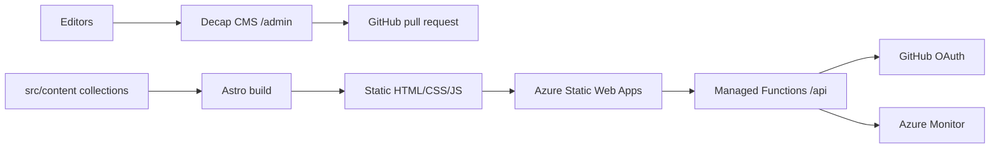

# Architecture

## Decisions

- Static-first pages keep hosting simple and fast.
- Content collections use Zod so editors get early validation.
- The event model separates home events from community listings with `host: home | community`.
- Recurring series generate future occurrences; one-off entries override specific dates.
- The build computes CSP hashes and rejects inline `style=""` attributes.
- The map uses Leaflet and OpenStreetMap; geocoding is Census-first with Nominatim fallback at one request per second.
